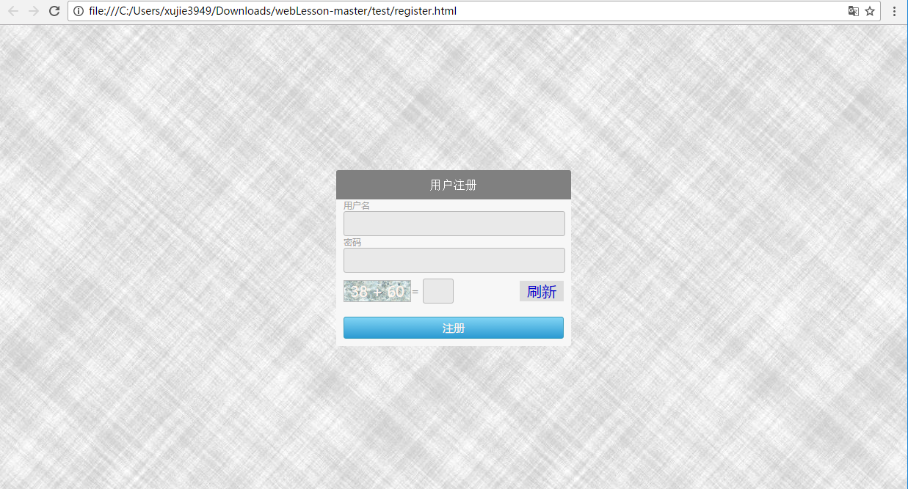
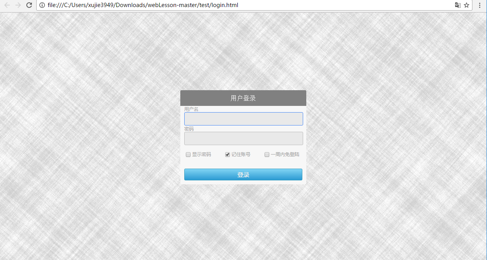
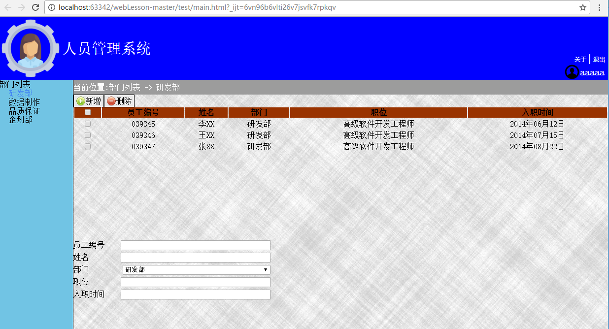

# 练习题
制作一个网站,由注册,登录,主页面组成.为了简单期间,其中牵涉到数据访问的可以用本地存储代替.

* 注册页面

	* 背景图片铺满整个窗口
	* 注册窗口水平和垂直居中放在页面中
	* 需要有注册码功能,可以刷新注册码
	* 注册成功后弹出对话框,点击确定后跳转到登录页面
* 登录页面  

	* 背景图片铺满整个窗口
	* 登录窗口水平和垂直居中放在页面中
	* 需要有显示密码,记住账号,一周内免登录选项
	* 当勾上记住账号时,登录时需要将账号记录下来,下次访问登录页面时直接自动填上
	* 登录成功后直接跳转到主页面
* 主页面

	* 主页面铺满整个窗口,随窗口调整大小而随着变化
	* 由标题栏,导航栏,内容组成
	* 标题栏显示当前登录的用户,提供退出按钮,退出后再直接访问主页面将被重定向到登录页面,除非登录时勾上了一周内免登录
	* 登陆超时后,自动重定向到登录页
	* 导航栏的部门列表点击可以收起和展开下面的部门列表
	* 点击部门列表中的项,右边的内容页显示当前部门下的员工列表,当前位置栏随着变化
	* 员工列表前面的复选框可以选中当前行,标题栏的复选框可以选中所有行.
	* 员工列表下面的表单可以填写员工信息,然后通过新增按钮添加到员工列表中.
	* 勾选员工列表中的某几行后,可以通过删除按钮进行删除